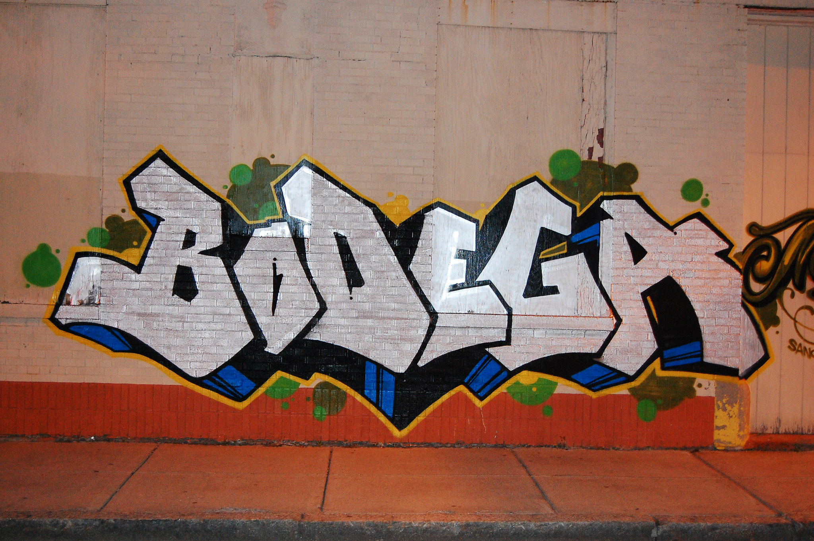

### A simple store for all your basic needs. 🐱

If you find Bodega valuable I would really appreciate it if you would consider helping [sponsor my open source work](https://github.com/sponsors/mergesort), so I can continue to work on projects like Bodega to help developers like yourself.

---

As a born and raised New Yorker I can attest that [bodegas](https://en.wikipedia.org/wiki/Bodega_(store)) act as humble infrastructure for our city, and Bodega aims to do that as well. We appreciate what bodegas do for us, yet it's their simplicity and prevalence that almost makes us forget they're here.

Bodega is an actor-based library that started as a simple cache based on reading and writing files to/from disk with an incredibly simple API. The `DiskStorageEngine` still provides that functionality, but Bodega has also blossomed into so much more, offering a form of infrastructure that any app's data can use.

Bodega's `StorageEngine` is at the heart of what's possible. Conforming any database, persistence layer, or even an API server, to the `StorageEngine` protocol automatically provides an incredibly simple data layer for your app thanks to Bodega's `ObjectStorage`. Rather than `Data` and databases developers interact with their app's Swift types no matter what those may be, have a unified API, and concurrency handled out of the box.

Bodega is fully usable and useful on its own, but it's also the foundation of [Boutique](https://github.com/mergesort/Boutique). You can find a reference implementation of an app built atop Boutique in the [Boutique Demo folder](https://github.com/mergesort/Boutique/tree/main/Boutique%20Demo), showing you how to make an offline-ready realtime updating SwiftUI app in only a few lines of code. You can read more about the thinking behind the architecture in this blog post exploring Boutique and the [Model View Controller Store architecture](https://build.ms/2022/06/22/model-view-controller-store).

---

* [Getting Started](#getting-started)
* [StorageEngine](#storage-engines)
* [ObjectStorage](#objectstorage)
* [Further Exploration](#further-exploration)

---

### Getting Started

Bodega provides two kinds of storage primitives for you, `StorageEngine` and `ObjectStorage`. A `StorageEngine` is for writing `Data` to a persistence layer, whether it's files on disk, SQLite, or your own database. An `ObjectStorage` offers a unified layer over `StorageEngine`s, providing a single API for saving `Codable` objects to any `StorageEngine` you choose. `Bodega` offers `DiskStorageEngine` and `SQLiteStorageEngine` by default, or you can even build a `StorageEngine` based on your app's API server if you want a simple way to interface with your API. You can even compose storage engines to create a complex data pipeline that hits your API and saves items into a database, all in one API call. The possibilities are endless.

---

### DiskStorage

```swift
// Initialize a DiskStorage object
let storage = DiskStorage(
    directory: .documents(appendingPath: "Quotes")
)

// CacheKeys can be generated from a String or URL.
// URLs will be reformatted into a file system safe format before writing to disk.
let url = URL(string: "https://redpanda.club/dope-quotes/dolly-parton")
let cacheKey = CacheKey(url: url)
let data = Data("Find out who you are. And do it on purpose. - Dolly Parton".utf8)

// Write data to disk
try await storage.write(data, key: cacheKey)

// Read data from disk
let readData = await storage.read(key: cacheKey)

// Remove data from disk
try await storage.remove(key: Self.testCacheKey)
```

---

### ObjectStorage

`ObjectStorage` has a very similar API to `DiskStorage`, but with slight naming deviations to be more explicit that you're working with objects and not data.

```swift
// Initialize an ObjectStorage object
let storage = ObjectStorage(
    directory: .documents(appendingPath: "Quotes")
)

let cacheKey = CacheKey("churchill-optimisim")

let quote = Quote(
    id: "winston-churchill-1",
    text: "I am an optimist. It does not seem too much use being anything else.",
    author: "Winston Churchill",
    url: URL(string: "https://redpanda.club/dope-quotes/winston-churchill")
)

// Store an object
try await storage.store(quote, forKey: cacheKey)

// Read an object
let readObject: Quote? = await storage.object(forKey: cacheKey)

// Grab all the keys, which at this point will be one key, `cacheKey`.
let allKeys = await storage.allKeys()

// Verify by calling `keyCount`, both key-related methods are also available on `DiskStorage`.
await storage.keyCount()

// Remove an object
try await storage.removeObject(forKey: cacheKey)
```

---

### Further Exploration

Bodega is very useful on its own for saving files and objects to disk, but it's made even more powerful by using [Boutique](https://github.com/mergesort/Boutique). Boutique is a `Store` and serves as the foundation of a Model View Controller Store architecture I've developed. MVCS brings together the familiarity and simplicity of the [MVC architecture](https://developer.apple.com/library/archive/documentation/General/Conceptual/DevPedia-CocoaCore/MVC.html) you know and love with the power of a `Store`, to give your app a simple but well-defined state management and data architecture.

If you'd like to learn more about how it works you can read about the philosophy in a [blog post](https://build.ms/2022/06/22/model-view-controller-store) where I explore MVCS for SwiftUI, and you can find a reference implementation of an offline-ready realtime updating MVCS app powered by Boutique in this [repo](https://github.com/mergesort/MVCS).

---

### Requirements

- iOS 13.0+
- macOS 11.0
- Xcode 13.2+

### Installation

#### Swift Package Manager

The [Swift Package Manager](https://www.swift.org/package-manager) is a tool for automating the distribution of Swift code and is integrated into the Swift build system.

Once you have your Swift package set up, adding Bodega as a dependency is as easy as adding it to the dependencies value of your `Package.swift`.

```swift
dependencies: [
    .package(url: "https://github.com/mergesort/Bodega.git", .upToNextMajor(from: "1.0.0"))
]
```

#### Manually

If you prefer not to use SPM, you can integrate Bodega into your project manually by copying the files in.

---

### About me

Hi, I'm [Joe](http://fabisevi.ch) everywhere on the web, but especially on [Twitter](https://twitter.com/mergesort).

### License

See the [license](LICENSE) for more information about how you can use Bodega.

### Sponsorship

Bodega is a labor of love to help developers build better apps, making it easier for you to unlock your creativity and make something amazing for your yourself and your users. If you find Bodega valuable I would really appreciate it if you'd consider helping [sponsor my open source work](https://github.com/sponsors/mergesort), so I can continue to work on projects like Bodega to help developers like yourself.
